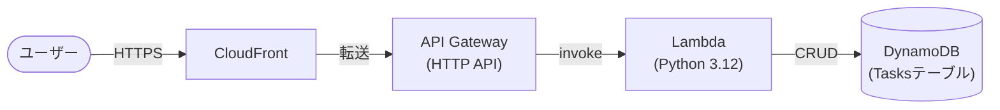
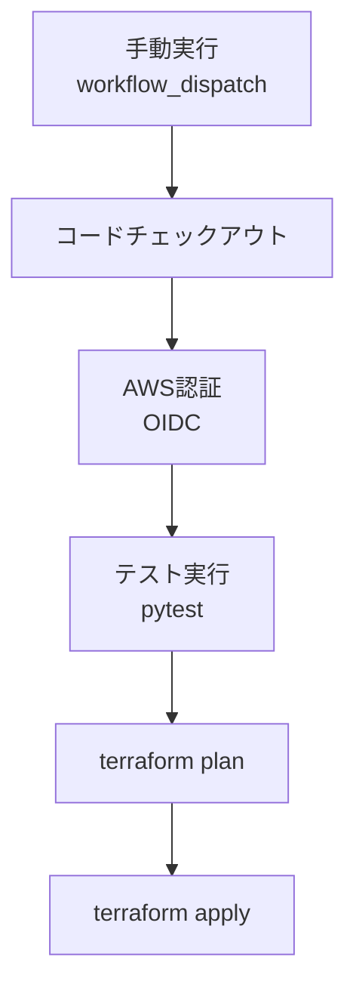

## プロジェクト概要

タスク管理APIをベースに、IaC・CI/CD・モニタリングを一通り実装したポートフォリオ。

APIはLambda / API Gateway / DynamoDB / CloudFrontのAWSマネージドサービスのみで構成し、インフラ管理の手間とコストを最小化した。Terraformによるインフラのコード化、GitHub ActionsによるCI/CDパイプライン、CloudWatch/SNSによる監視・通知を実装している。

## アーキテクチャ



### APIエンドポイント

| メソッド | パス        | 説明           |
| -------- | ----------- | -------------- |
| GET      | /tasks      | タスク一覧取得 |
| POST     | /tasks      | タスク作成     |
| GET      | /tasks/{id} | タスク取得     |
| PUT      | /tasks/{id} | タスク更新     |
| DELETE   | /tasks/{id} | タスク削除     |

## 技術スタック

| カテゴリ         | 技術                                                        |
| ---------------- | ----------------------------------------------------------- |
| アプリケーション | Python 3.12                                                 |
| インフラ         | AWS Lambda / API Gateway (HTTP API) / CloudFront / DynamoDB |
| IaC              | Terraform 1.15.5                                            |
| CI/CD            | GitHub Actions (OIDC認証)                                   |
| 監視             | CloudWatch Logs / CloudWatch Alarm / SNS                    |
| テスト           | pytest / pytest-mock                                        |
| ローカル開発     | DynamoDB Local (Docker Compose)                             |
| tfstate管理      | S3バックエンド                                              |

## ディレクトリ構造

```
task-api/
├── .github/
│   └── workflows/
│       └── deploy.yml        # CI/CDパイプライン
├── infra/
│   ├── main.tf               # プロバイダー・S3バックエンド設定
│   ├── dynamodb.tf           # DynamoDBテーブル
│   ├── lambda.tf             # Lambda関数・IAMロール
│   ├── api_gateway.tf        # API Gateway
│   ├── cloudfront.tf         # CloudFront
│   ├── monitoring.tf         # CloudWatch・SNS
│   └── oidc.tf               # GitHub Actions用OIDC
├── src/
│   ├── __init__.py
│   └── handlers/
│       ├── __init__.py
│       └── task_handler.py   # Lambdaハンドラー
├── tests/
│   └── test_task_handler.py  # ユニットテスト
├── docker-compose.yml        # DynamoDB Local
├── README.md
└── requirements.txt          # pytest・pytest-mock・boto3
```

## CI/CD

### パイプライン構成



### 設計のポイント

**OIDC認証を採用**
アクセスキーの管理・ローテーション運用を不要にするため。

**テストの配置**
テスト失敗時にapplyが走らないよう品質ゲートとして配置

**トリガーをworkflow_dispatchにした理由**
pushのたびに自動applyするとコストが発生し続けるため、手動実行に切り替えた。自動applyの設定はコメントアウトして残しており、必要に応じて切り替え可能な状態にしている。

## IaC（Terraform）

### 設計のポイント

**tfstateをS3バックエンドで管理**
CIとローカルで同一のtfstateを参照する構成。なお、通常ならDynamoDBでのロック機能を併用するが、個人開発かつコスト最小化の方針のため今回は省略している。

**コスト最小化設計**
Lambda・DynamoDB（PAY_PER_REQUEST）・API Gateway（HTTP API）はいずれもAWS無料枠内で運用可能。
API GatewayはREST APIではなくHTTP APIを選定しており、コスト・シンプルさの両面で今回の用途に適している。
ローカル開発はDynamoDB Localを使用し、開発時のAWSアクセスを不要にしている。
CloudWatch Logsは本番運用の慣習に合わせひとまず30日に設定。

## モニタリング

### 構成

| 項目       | 設定                                                   |
| ---------- | ------------------------------------------------------ |
| ログ保存   | CloudWatch Logs（保持期間30日）                        |
| エラー検知 | CloudWatch Alarm（1分間に1回以上のLambdaエラーで発火） |
| 通知       | SNS → メール                                           |

### 設計のポイント

**通知先の管理にSSMパラメータストアを使用**
メールアドレスはSSMパラメータストア（SecureString）で管理している。

**SNSでの通知構成にした理由**
今回は通知先が1名のみのため、SNSを使わずメール直送でも実現できるが、SNSを挟むことで、将来的に通知先を複数に増やす・SlackやLambdaに繋ぐといった拡張が容易になる構成にしている。

## ローカル起動手順

### 前提条件

- Python 3.12
- Docker / Docker Compose
- AWS CLI（SSO設定済み）
- Terraform 1.15.5

### 手順

**1. リポジトリのクローン**

```bash
git clone https://github.com/sa-dev-sketch/task-api.git
cd task-api
```

**2. Python仮想環境のセットアップ**

```bash
python3 -m venv .venv
source .venv/bin/activate
pip install -r requirements.txt
```

**3. ローカル用AWSプロファイルの設定**
DynamoDB Localへの接続時にboto3がAWS認証情報を要求するため、ダミーのプロファイルを事前に作成する。プロファイル名は任意。

```bash
aws configure --profile <任意のプロファイル名>
# プロファイル例
# AWS Access Key ID: dummy
# AWS Secret Access Key: dummy
# Default region name: ap-northeast-1
# Default output format: json
```

**4. DynamoDB Localの起動**

```bash
docker compose up -d
```

**5. テストの実行**

```bash
python3 -m pytest tests/
```
